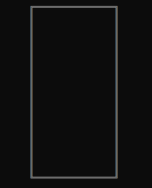

## Tetris Game
- [x] The up key is for rotation, the down key is for speeding up, and the right-left keys are for moving to the right and left.
- [x] As you see in the gif, you can rotate, and stack the shapes, and destroy the line if it is full with the shapes.
- [x] This game will be continued to be developed.
- [x] Terminal dimensions should be 120x49. Otherwise, the game will not work properly.

#### TODO
- [x] Fix destroying of the lines.
- [x] Show scenes of the next shape, current score, lines, and game over.
- [x] Show the highest score.

